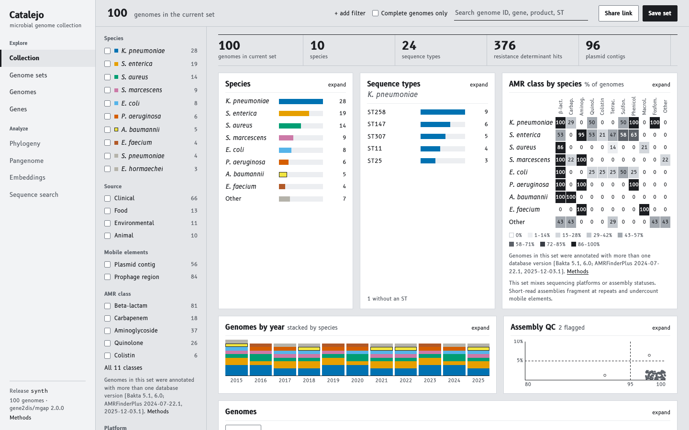

# Catalejo

Catalejo Genómico is a web platform for looking at a curated collection of microbial genomes produced by the mgap pipeline, with their annotation, resistance determinants, mobile elements, typing results, pangenomes, phylogenies and, later, embeddings. The name means a genomic spyglass. The platform is called Catalejo Genómico in prose and citations and Catalejo in the interface, while the repository, the ingestion package and its command are `catalejo`, without the accent.

Researchers, clinical microbiologists and students read the collection through a static application that opens each release directly in the browser, and a single maintaining group produces the releases with the `catalejo` command.



The screenshot shows the Collection page on the synthetic release at 1440 × 900 pixels.

## Tiers

| Tier | Content | Server needed |
|---|---|---|
| 0 | All pages except Embeddings and Sequence search, on data from mgap, pangenomes and trees | No |
| 1 | Embeddings page and "similar genomes" on the genome page, from genome-level embeddings shipped in the release | No |
| 2 | Sequence search (alignment over cluster representatives, then protein-level vector search with query-time embedding) | Yes, one service operated by the maintaining group |

Tiers add pages and data without changing the shell, the existing tables or the release layout, and a release declares in its manifest which of them it contains.

## Documents

The data contract in [docs/data-contract.md](docs/data-contract.md) defines every table, file and format the platform reads and writes, and the requirements in [docs/requirements.md](docs/requirements.md) define every page, its behavior and its acceptance items. When the code and these two documents disagree, the documents win. [docs/setup.md](docs/setup.md) describes the toolchain and how a development session runs, and [docs/deployment.md](docs/deployment.md) describes how to run an instance on Cloudflare, from the one-time setup to publishing releases.

## Repository layout

```
packages/ingest/     Python 3.13 and uv; the catalejo command (see packages/ingest/README.md)
packages/web/        TypeScript, Node 24, pnpm, Vite and React; the static application (see packages/web/README.md)
config/              platform, palette, design tokens, species registry, typing display, summary templates,
                     export presets, version pins
docs/                data contract, requirements, critic checklist, setup, and images/ for the README
tests/fixtures/      files shared by both packages, such as the Parquet cross-read fixture
.github/workflows/   ci.yml, release.yml, deploy.yml
```

Synthetic data and local catalogs are written under `data/` (the synthetic catalog goes to `data/catalog/`), and releases under `releases/`. Git ignores all of them, together with `catalog/`, where the maintaining group keeps the catalogs of real releases.

## Running Catalejo locally

Running the application on the synthetic release needs git, uv, Node 24 and pnpm 10.10.0. The first run also needs network access, since uv downloads Python 3.13 and the Python packages, pnpm downloads the npm packages, and the development server fetches the pinned DuckDB extensions from extensions.duckdb.org. Everything together takes about 1 GB of disk.

uv installs and manages Python 3.13 itself, so no system Python is needed. On macOS it installs with Homebrew.

```
brew install uv
```

On Linux, or on macOS without Homebrew, the installer script does the same.

```
curl -LsSf https://astral.sh/uv/install.sh | sh
```

Node 24 is the version named in `.node-version` at the repository root. With fnm, which reads that file, it installs as follows, and §1 of [docs/setup.md](docs/setup.md) gives the line for `~/.zshrc` that makes new terminals use it.

```
fnm install 24
```

With nvm the equivalent is the following.

```
nvm install 24
```

pnpm 10.10.0 is the version named in the `packageManager` field of `packages/web/package.json`, and corepack, which ships with Node, provides it once enabled.

```
corepack enable pnpm
```

The following sequence clones the repository, builds the synthetic release and starts the application. Its `catalejo` lines are copied from the "Synthetic release" step of `.github/workflows/ci.yml`, so a local build follows the same steps as CI.

```
git clone https://github.com/microbialds/catalejo.git
cd catalejo
uv sync --project packages/ingest
catalejo() { uv run --project packages/ingest catalejo "$@"; }
catalejo synth --species 10 --genomes 100 --out data/synth
catalejo metadata init --mgap data/synth/results --existing data/synth/metadata.csv --out data/synth/metadata.csv
catalejo ingest --mgap data/synth/results --metadata data/synth/metadata.csv --catalog data/catalog/synth.duckdb
catalejo tombstones ingest --file data/synth/tombstones.csv --catalog data/catalog/synth.duckdb
catalejo groups ingest --groups data/synth/groups.csv --members data/synth/genome_groups.csv --catalog data/catalog/synth.duckdb
catalejo sets ingest --file data/synth/sets.csv --catalog data/catalog/synth.duckdb
catalejo release check --catalog data/catalog/synth.duckdb --metadata data/synth/metadata.csv --mgap data/synth/results
catalejo release build --catalog data/catalog/synth.duckdb --out releases/synth
catalejo release check --catalog data/catalog/synth.duckdb --release releases/synth
pnpm --dir packages/web install
pnpm --dir packages/web dev
```

When the last command reports that the server is ready, the application is at http://localhost:5173. The line that starts with `catalejo()` defines a shell function, which works in zsh and bash, so that `catalejo` runs the command through uv for as long as this terminal stays open. Every command runs from the repository root. `synth` writes 100 genomes of 10 species to `data/synth/`, the `ingest` commands build the catalog in `data/catalog/synth.duckdb`, `release build` writes the release to `releases/synth`, and the two `release check` commands validate the catalog before the build and the checksums of the release after it. The development server serves `releases/synth` under `/data/`, so the release must exist before the application shows any data. Release files are cached by the browser as immutable, so after rebuilding the release under the same identifier, reload the page without the cache (Cmd+Shift+R on macOS, Ctrl+Shift+R elsewhere).

The end-to-end tests are optional and run against the same synthetic release. They need the Chromium build of Playwright, about 0.5 GB more, which the first command below installs. On Linux, add `--with-deps` to that command so that it also installs the system libraries Chromium needs.

```
pnpm --dir packages/web exec playwright install chromium
pnpm --dir packages/web e2e
```

The ingest and web package READMEs, [packages/ingest/README.md](packages/ingest/README.md) and [packages/web/README.md](packages/web/README.md), describe the remaining commands and tests.

## Using Catalejo

The application opens on the Collection page, which describes the current genome set, the whole release until a filter narrows it. A strip of counters gives the number of genomes, species, sequence types, resistance determinant hits and plasmid contigs, and the panels below show the genomes by species, the sequence types of the selected or largest species, the percent of genomes carrying each resistance class by species, the genomes by year stacked by species, and the CheckM2 completeness and contamination of every genome. The facet rail on the left counts the genomes of the set by species, source, mobile elements, AMR class, platform and assembly status. Checking a facet value adds it as an alternative within its field, so that two species checked together keep the genomes of either, while filters on different fields must all hold. A click on a bar, a heatmap cell or a year narrows the set to that element, replacing the values already chosen in the fields it names, and a rectangle dragged on the assembly QC panel keeps the genomes within its completeness and contamination. Each panel can be expanded to the full width of its row.

The bar at the top of every page shows the current set, with its genome count and one chip for each active filter, each chip with its own remove control. When the chips do not fit on one line, the bar shows those that fit and a "+N more" control that lists all of them. "+ add filter" opens a menu with every filter field, "Complete genomes only" keeps complete assemblies, "Share link" copies a link that reproduces the set and the table view, and "Save set" downloads the set as a file in the exchange format of contract §7.5. Below 1200 px these actions sit behind a "Set" control and the facet rail opens as a drawer from "Filters", and below 900 px the navigation becomes a menu, which also holds the search field.

The search field finds genome identifiers, BioSample and assembly accessions, gene symbols, element names, products and sequence types, and lists the matches grouped by kind with their counts. Choosing a sequence type replaces the set with a filter on it, while genome and gene results keep the current set.

The genome table at the foot of the Collection page lists the genomes of the set 50 at a time. A click on a column heading sorts by that column, "Columns" chooses which columns are shown, and the Typing column shows the species-specific typing results, such as the K and O loci of *Klebsiella pneumoniae* or the serovar of *Salmonella enterica*. Rows can be selected, and "Use as set" replaces the current set with the selection after a confirmation that states the new count. The Genomes page shows the same table as a full page, and the sort, the page and the columns carry over between the two pages.

Links keep the current set, except a link that is itself a filter. Species names and sequence types link to the collection filtered by them, genome identifiers link to their genome page, and moving between pages through the navigation keeps the set.

Until the pages that remain are built, each shows a short placeholder. The genome page arrives in milestone 2, the Genome sets and Genes pages in milestone 3, the Phylogeny and Pangenome pages in milestone 4, the Methods and Releases pages in milestone 5 and the Embeddings page in milestone 6, while Sequence search belongs to Tier 2 and is deferred. The Methods page will be linked from the footer of every page, where the link already appears. A guide for collaborators, in English and Spanish, also comes with milestone 5.

## License

MIT, see [LICENSE](LICENSE).

## Citation

If you use Catalejo Genómico, please cite it with the metadata in [CITATION.cff](CITATION.cff).

## AI-assisted development

Catalejo was developed with the assistance of Claude (Anthropic) models under the direction of the maintaining group. Model versions used in each development milestone are recorded in an internal development log, available on request.
